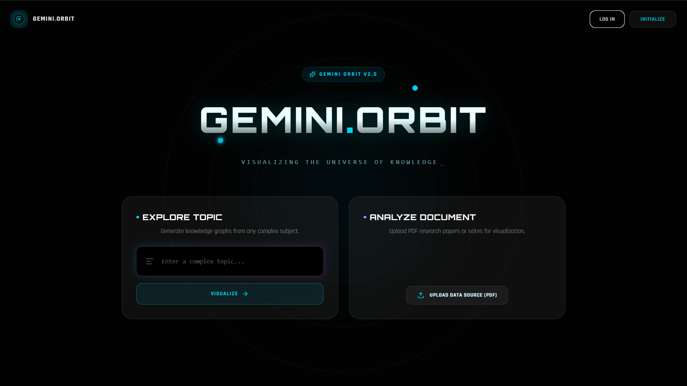
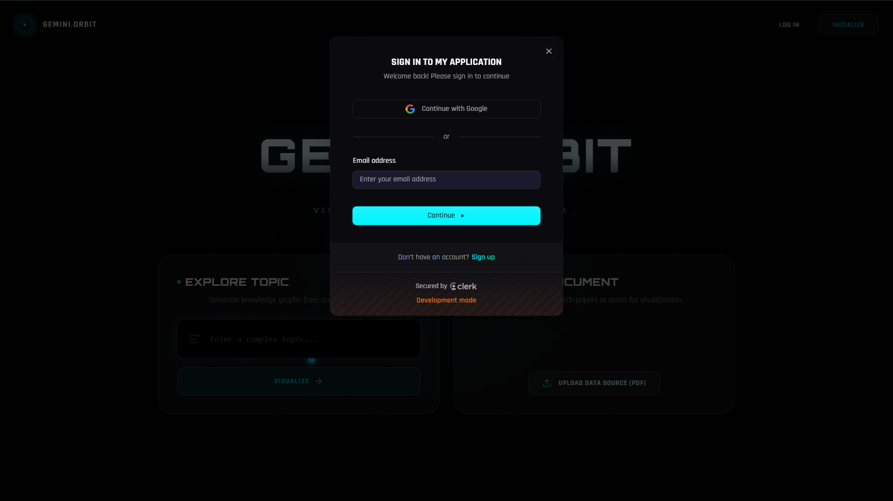
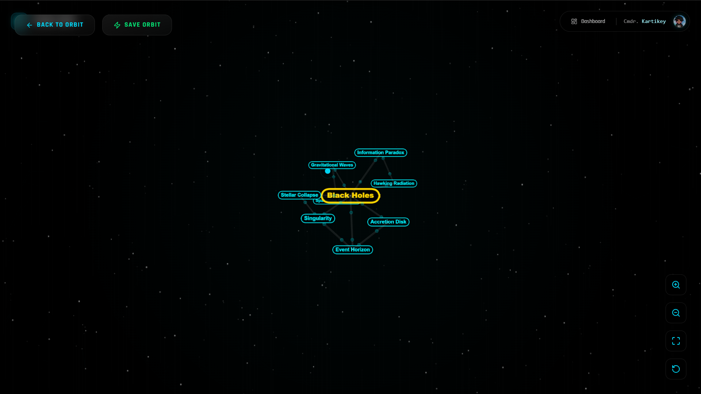
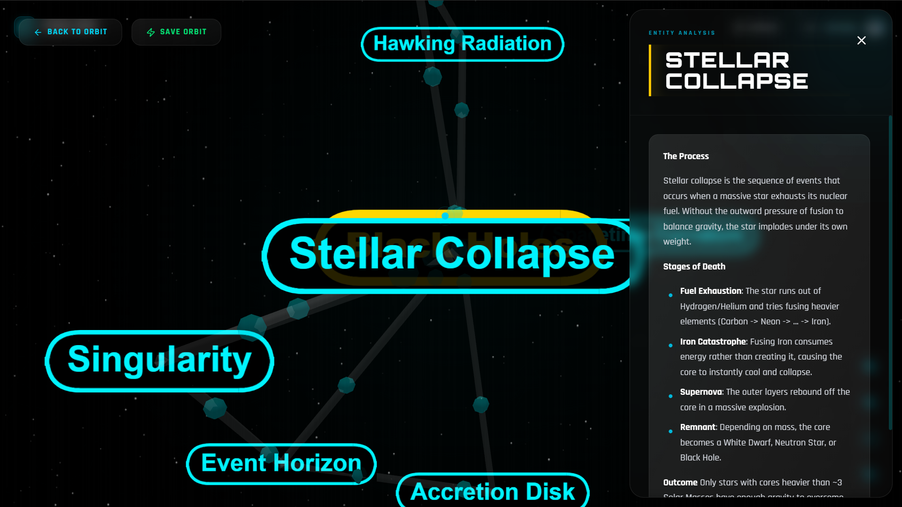

# Gemini Orbit

Gemini Orbit is an AI-powered platform that transforms complex topics into **interactive 3D knowledge graphs**.
**Submitted to the Gemini-3-Hackathon**

Instead of reading static text, users explore concepts visually in a dynamic knowledge universe generated by **Google Gemini AI**.

---

## Live Demo

## Live Demo

Frontend (Vercel):  
[https://gemini-orbit-pied.vercel.app](https://gemini-orbit-pied.vercel.app)

Youtube:
[Demo Video](https://www.youtube.com/watch?v=WY-lYlKgmrA&t=15s)

---

## Demo

Enter any topic such as:

Black Holes  
Neural Networks  
Quantum Physics  

Gemini generates a **3D constellation of related concepts** where:

• Nodes represent ideas  
• Edges represent relationships  
• Clicking a node reveals an AI-generated explanation  

---

## Preview

### Home

### Login / Register

### Knowledge Graph

### Concept Details

---

## Features

### AI Knowledge Graph Generation
Generate structured concept graphs using Google Gemini.

### Interactive 3D Visualization
Explore concepts using real-time 3D rendering powered by Three.js.

### AI Concept Explanations
Click any node to receive contextual explanations.

### Persistent Knowledge Library
Save generated graphs and revisit them anytime.

---

## Architecture

Frontend (Next.js + Three.js)

↓

Spring Boot REST API

↓

Google Gemini API

↓

PostgreSQL Database

---

## Tech Stack

### Frontend
Next.js  
TypeScript  
React  
TailwindCSS  
Three.js  
react-force-graph  

### Backend
Java  
Spring Boot  
REST APIs  

### AI
Google Gemini Pro API  

### Database
Neon Serverless PostgreSQL  

### Authentication
Clerk  

### Deployment
Frontend → Vercel  
Backend → Docker on Koyeb  

---

## Project Structure
frontend/ → Next.js application
backend/ → Spring Boot REST API
docs/ → architecture and demo images

---

## Running the Project

### Backend
cd backend
./mvnw spring-boot:run

### Frontend
cd frontend
npm install
npm run dev

---

## Environment Variables
GEMINI_API_KEY=your_api_key
DATABASE_URL=your_database_url
CLERK_SECRET_KEY=your_clerk_secret

---

## Challenges

Building a distributed full-stack system introduced challenges with:

• CORS between Vercel frontend and Koyeb backend  
• Ensuring Gemini consistently returned valid JSON graph structures  
• Managing secure communication between services  

These were solved through **strict API validation and structured prompt engineering**.

---

## Future Improvements

Real-time collaborative graph exploration  
VR-based knowledge visualization  
Editable concept graphs  
Export graphs as study material  

---

## Repositories

Frontend: [[gemini-orbit-pied.vercel.app](https://github.com/Asma-Khanum1722/gemini-orbit)]([https://gemini-orbit-pied.vercel.app](https://github.com/Asma-Khanum1722/gemini-orbit))

---

## Built With

Java • Spring Boot • Next.js • React • Three.js  
TailwindCSS • PostgreSQL • Gemini AI • Docker  
Vercel • Koyeb • Neon • Clerk
